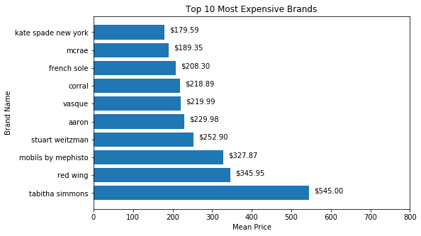
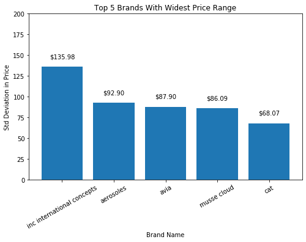
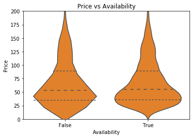
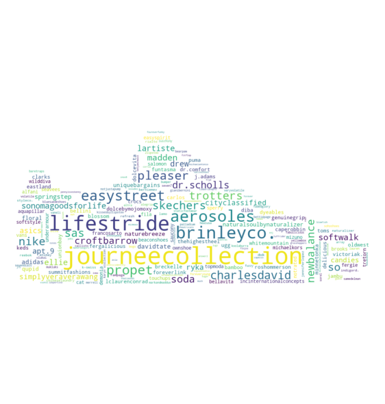

# Women's Shoe Data Analysis

## Objective

The objective of this project is to explore the women's shoe sample dataset provided by Datafiniti https://datafiniti.co

This project will answers the questions below using visualization:

1. What are the top 10 most expensive brands?

2. Which brands have wide price distribution?

3. Do unavailability of an item affect its price? 

4. Which brand is listed the most among retailers?

## Dataset

The data is publicly available on Kaggle https://www.kaggle.com/datafiniti/womens-shoes-prices#Datafiniti_Womens_Shoes.csv

The dataset consist of 10,000 listing of women's shoes updated between January and October 2018, and another 10,000 between March 2019 and May 2019

**It should be noted that the dataset is only provided as a SAMPLE and might not be fully complete, as such the result of the analysis might not reflect the true condition**


### Quality

`prices.availability` has different value for in stock or out of stock, need to convert to true or false or blank

```
True, TRUE, In Stock = 1
False, Out Of Stock = 0
nan = -1
```

`brand` is quite messy, the column has values which point to the same brand but different capital letters or spelling (e.g. `Nike`, `nike` and `nike shoes`), we need to convert them into consistent naming

`prices.amountMax and prices.amountMin` seems to contain outliers which set price at 5000 and 999.99, we will remove these

Some columns contain missing values, however, since we are not using them we will leave them as is

### Tidiness

`categories, color and sizes` contain comma separated values. These columns need to be separated if we want to evaluate them

## Visualization

### Most Expensive



From the bar chart, it is clear that `Tabitha Simmons` is the most expensive brands listed among the retailers

### Price Distribution



The wide price distribution might indicate that these brands are often on sale, hence the big price difference from time to time

### Unavailability vs Price



It is often rumored that retailers take advantage of unavailability of the item to set its price lower in order to make them looks like a good bargain retailer, however, according to the violin plot above, this is not the case. 

The left violin is price distribution when the items are not available, the right is when the items are available. We can see that they are similarly shaped with similar inter quartile range. Hence there is no evidence that when an item is unavailable its price is reduced.

### Most listed brands




The word cloud image above is generated using most frequent occurence of words. We can see that the most listed brand is Journee Collection as it takes the biggest portion of the 'shoe' ;)


